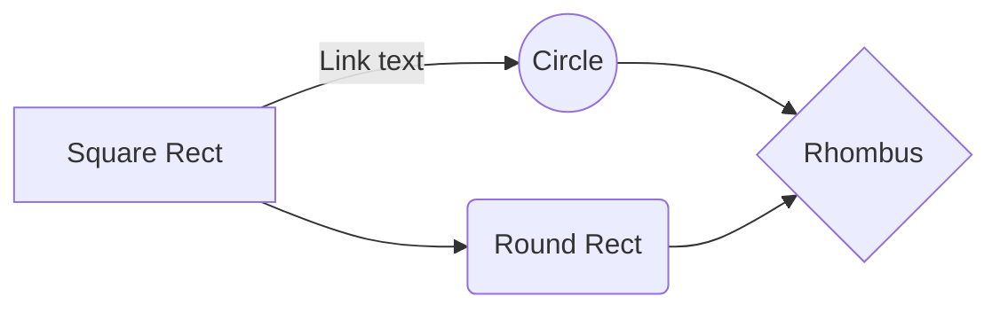

`foo.md`
===

## Code block

```main.c
#include <stdio.h>

int main() {
  printf("Hello, world!\n");
  return 0;
}
```

## mermaid.js



## Link

[`se-test/foo.md`]

> Written with [StackEdit](https://stackedit.io/).
<!--stackedit_data:
eyJoaXN0b3J5IjpbMTAyNDkwOTgxNSwtMjAxOTkyNTI2MF19
-->