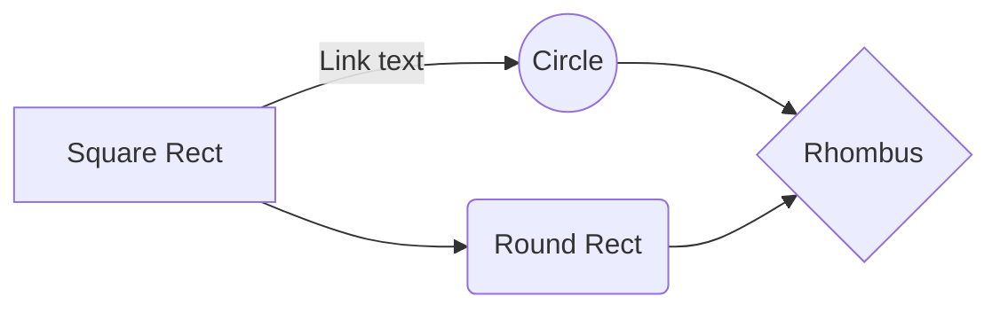

`foo.md`
===

## Code block

```main.c
#include<stdio.h>

int main() {
  printf("Hello, world!\n");
  return 0;
}
```

## mermaind



> Written with [StackEdit](https://stackedit.io/).
<!--stackedit_data:
eyJoaXN0b3J5IjpbLTk0ODQ4OTQ2OV19
-->