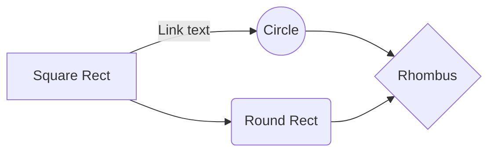

`foo.md`
===

## Code block

```main.c
#include <stdio.h>

int main() {
  printf("Hello, world!\n");
  return 0;
}
```

## mermaid.js



## Link

[`se-test/foo.md`](./foo.md)
[`se-test/foo.html`](./foo.html)

## List

1. one
2. two
3. three
$$
y=f(x)
$$
the
4. aaa


> Written with [StackEdit](https://stackedit.io/).
<!--stackedit_data:
eyJoaXN0b3J5IjpbMTM4NDEyNzQ3NywtMTk5NDAyMDcxNCwtMT
g4OTg5OTU4NCwtMjAxOTkyNTI2MF19
-->